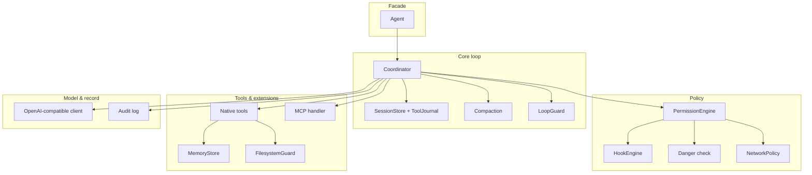

# Architecture

`Barq-SDK` (imported as `barq_sdk`; the legacy `engine` name still works and resolves to the same objects) is a small library for building tool-using AI agents. It is organised as a set of
decoupled packages around one agent loop; a caller injects a model and tools and drives
either the high-level `Agent` or the lower-level `Coordinator`.

## Topology

## The agent loop (`engine/coordinator.py`)

A standard tool-use loop over small Protocols (`ModelClient`, tool callables), so it is
unit-testable with a scripted fake model - no API key.

Each turn: call the model → for every `tool_use` block, run it through the permission path,
then dispatch it (native first, then MCP) → feed results back. Key properties:

- **Every tool call is permissioned and audited** before it runs, and **validated against
  its declared `input_schema`**: a violation is returned to the model as a fixable error
  instead of reaching the handler.
- **Bounded**: every tool call runs under `tool_timeout`, so one unresponsive tool or MCP
  server cannot hang the agent. Same-turn calls run **concurrently** (`max_parallel_tools`),
  with results kept in call order.
- **Metered**: token usage from every response accumulates on `Coordinator.usage`, and
  `token_budget` stops the run at a spend ceiling.
- **Untrusted-output fencing**: tool output is wrapped in an "UNTRUSTED - treat as data"
  frame by default (a cheap prompt-injection mitigation); a caller can exempt trusted tools.
- **Turn budget** with a wrap-up nudge near the end and a `max_tokens` recovery nudge, so a
  run converts work into output instead of being cut off silently. Every steering message
  answers any pending tool call first, so the transcript stays valid on the wire (an
  assistant turn with an unanswered `tool_calls` is a hard 400 on OpenAI/Azure).
- **Crash-resume**: the transcript is snapshotted at each turn boundary (`SessionStore`), and
  a `ToolJournal` makes tool execution **exactly-once** on resume (a tool that already ran
  is not re-run). `Coordinator.completed` distinguishes "finished" from "hit max_turns".
- **`send()`** keeps a transcript across messages for multi-turn conversations. `run()` and
  `send()` are thin entry points onto one driver (`_drive`), so a loop fix cannot land in
  one and be missed in the other.
- Optional **`LoopGuard`** (degenerate-repetition circuit breaker) and **`context_compactor`**
  (invoked before each model round-trip) plug in here.

## Permissions (`engine/permissions/`)

`PermissionEngine.check(_async)` resolves each `ToolCall` in this order, fail-closed:

0. **Fail-closed wrapper**: if any step below raises, the decision is **ASK**, never
   allow, and never an exception escaping into the loop. A hook that *crashes* has no
   verdict, so it cannot be read as "no objection".
1. **PreToolUse hook gate**: a registered hook may deny (terminal, immediately) or ask.
   An **allow is held, not obeyed**: it suppresses the discretionary stages below (rules,
   soft-danger, classifier, mode default) but does not survive stages 2 and 3, which are
   non-overridable. A hook that allowed used to short-circuit the whole pipeline, so
   `rm -rf /` and a fetch of `169.254.169.254` were both permitted in LOCKED mode with an
   allowlist configured; a control anything upstream can switch off is not a control.
   Strictest verdict wins across hooks (deny > ask > allow), and a hook that RAISES
   escalates to ask even when another hook allowed. In the async path hooks run off the
   event loop (`asyncio.to_thread`), so a hook that shells out to a policy service cannot
   stall every other coroutine in the process.
2. **Hard-danger DENY**: catastrophic commands (`rm -rf /`, fork bomb, `mkfs`, raw device
   writes, `DROP TABLE`, `find / -delete`, interpreter one-liners that delete a system
   path) are denied *before any rule and past any hook allow*. A command tool is recognised
   by shape (an exact name, a name fragment, or a command-shaped argument), not by an
   exact-name set: this SDK ships no shell tool, so keying on the literal name `bash` meant
   the whole layer disengaged for a tool called `RunCommand` or `exec`.
   (`engine/permissions/danger.py`)
3. **Network policy** (optional): every host the call would contact (`network_targets`) is
   checked; a rejected host is denied, or asked if `network_ask` is set, except an internal
   endpoint, which is never approvable. A destination is found by TWO independent signals,
   at any depth: the key names one (`webhook_url`, `callbackUri`, `targetHost`), or the
   value is an absolute http(s) URL under a non-payload key. Key matching alone made the
   policy depend on the tool author's choice of noun: a field called `destination`, `to` or
   `cmd` carried a URL straight past the allowlist, as did anything nested one level down.
   Bash `/dev/tcp/host/port` sockets are recognised too. Reserved/internal addresses are
   denied in every notation a resolver accepts (decimal, hex, octal, short-form, v4-mapped
   v6) plus the hostnames that name one. The HTTP tool checks **the first request and every
   redirect hop** against the same policy, and strips credentials across a cross-origin hop.
   (`engine/permissions/network.py`)
4. **Explicit rules**: deny beats ask beats allow (`ToolName` / `ToolName(glob)` syntax).
   The tool-name half is itself a glob, so `mcp__github__*` covers a whole server's tools in
   one rule instead of enumerating every namespaced name.
5. **Soft-danger ASK**: dangerous-but-legit commands (`sudo`, force-push, pipe-to-shell).
6. **Injected classifier** (optional): an async LLM check; on error it ASKs, never allows.
7. **Mode default**: `AUTO` allow / `ASK` ask / `LOCKED` deny. A provably read-only shell
   command can be auto-allowed at this step via the read-only classifier.

Hooks (`engine/hooks/`) fire at exactly three lifecycle points, all wired in the loop:
`PreToolUse`, `PostToolUse`, `PermissionDenied` - there are no declared-but-never-fired
events. `FunctionHook` (in-process callable) and `CommandHook` (shell, exit 2 = block) are
supported. For observability rather than gating, prefer the run event stream below: it
covers turns, text, decisions, tool timing, usage and compaction without a hook per point.

## Run events, streaming and cancellation (`engine/events.py`)

A run used to be a function returning a transcript, which foreclosed streaming, progress,
cancellation and tracing in one move: there was nothing to observe until it was over. The
loop now emits a typed `AgentEvent` wherever something observable happens, and three
consumers sit on the same stream: `Agent.stream()` / `Coordinator.astream()` for async
iteration, `on_event=` for metrics and spans, and nothing at all (events are simply not
produced, and `run()` behaves exactly as before).

`OpenAICompatClient.stream()` parses the provider's SSE stream into text deltas and
reassembles the same `ModelResponse` the blocking path returns, so no downstream code knows
which was used. It is engaged only when something is listening.

`CancelToken` stops a run at the next safe boundary (between turns, or before the next tool
dispatch) rather than `Task.cancel()` tearing it down mid side-effect. A cancelled run
leaves a consistent transcript and a resumable session.

## Tools & extensions

- **Native tools** are `(spec, async_or_sync_handler)` pairs; the built-ins are file
  read/write, memory save/recall, and an opt-in HTTP tool.
- **MCP** (`engine/mcp/`) mounts any number of stdio servers; tool names are namespaced
  `server__tool`, and one server failing `list_tools` is isolated (recorded in `.failures`)
  rather than blanking every tool.
- **Memory** (`engine/memory/`) is a file-per-fact store with a `MEMORY.md` index and four
  types (`user`/`feedback`/`project`/`reference`). Recall scores **name, description and
  body** through an inverted index refreshed only for changed files, so a query costs
  roughly the number of matching memories rather than a re-read of the whole corpus.
  `namespace=` scopes a store to one tenant/user/session, keyed by a digest of the exact
  string so ids differing only in case or separator do not collapse onto one directory.
  Recall is deterministic keyword overlap; swap in a vector store for semantic recall.

  Memory content is **model-authored**, so it is not engine-controlled output: frontmatter
  fields are flattened on write (a newline in a model-supplied description could otherwise
  close the block and forge the document), `SaveMemory` refuses to clobber unless asked,
  every mutation is written to the audit log, and `RecallMemory` output is fenced as
  untrusted like any other tool result. Use the `a`-prefixed methods from async code; the
  sync ones block the event loop.
- **FilesystemGuard** (`engine/sandbox/filesystem.py`) confines writes to the workdir and
  makes credential paths (`~/.ssh`, cloud creds, `.env`, `*.pem`, …) unreadable. Relative
  paths resolve against the workdir, not the process CWD. The `Agent` facade additionally
  carves its own control plane (`workdir/.agent-state`) out of the readable AND writable
  region, so the agent cannot edit the audit log, session, journal or memory that record
  what it did.

- **Blocking I/O runs off the event loop.** Every file tool and every memory read does its
  filesystem work in a worker thread. Called inline they block the whole loop, not just the
  calling task (a `FindFiles` over 1,800 files was measured freezing it for 1.2s), which
  stalls every other agent in the process and makes `max_parallel_tools` meaningless.

## Model provider (`engine/providers/`)

One adapter (`OpenAICompatClient`) speaks the OpenAI `/chat/completions` wire format for all
providers; translation functions are pure and unit-tested. It retries transient failures
(429/5xx/transport) with backoff + `Retry-After`, surfaces reasoning-token usage, and takes
an injectable transport (mock in tests). `ModelRouter` maps roles (`FAST`, `SMART`) to
specs so a caller can split cheap vs. strong models.

## Audit (`engine/audit/`)

Records are **redacted before hashing** (credential headers, secret-shaped values), so the
chain covers exactly the bytes on disk and evidence verification still works: the log is
durable and non-repudiable, which is precisely why it must not become a secret store.
Appends take an OS lock on a sidecar file, and re-read the chain head under it **only when
the file grew since this writer's own last append**: re-parsing the tail every time was what
capped throughput at ~50 entries/sec (now ~900 with fsync, ~2,000 with
`durability="flush"`), while single-writer runs re-derived a head they already held.

Each record carries the tool ARGUMENTS, a `tool_use_id` and a `run_id`, bounded and
content-addressed so one oversized argument cannot bloat the chain. Recording only
`{tool, behavior, reason}` proved a log was unaltered while saying nothing about what
happened, which is the wrong half of the problem for a trail whose purpose is
non-repudiation.

An append-only, fsync'd JSONL log where every entry is **hash-chained** to the previous one,
so any insert, reorder, edit or deletion WITHIN the chain is detectable by `verify()`.
Truncation of the tail is not detectable from inside the file and cannot be: an in-file seal
is part of the tail that goes with it. Capture `AuditLog.anchor()` out of band and pass it
to `verify_audit_file(expected_head=..., expected_count=...)`. Optional HMAC keying makes the
chain unforgeable without the key; optional Ed25519 `seal()` produces third-party-verifiable
checkpoints. `log_exchange()` content-addresses the exact request/response so a later claim
can bind to precise evidence. Records export to ECS/CEF for SIEM ingestion.

## What this is not

There is no OS-level sandbox (network namespaces, bubblewrap): the FilesystemGuard and
network policy are in-process policy layers, not containment; run the agent in a container
if you need isolation. **Reads are not workdir-confined**: only credential regions and
secret-looking names are denied, so the write confinement is the real boundary.

Memory recall is keyword-based, not semantic. **DNS is not resolved before a policy check**,
so rebinding is unmitigated; enforce egress at the transport if that is in your threat model.
There is no OpenTelemetry integration: the event stream is the seam for one, but no spans are
emitted. MCP support is **stdio-only** and covers `tools/list`/`tools/call`; there is no
remote HTTP/SSE transport, no OAuth, and no resources, prompts, sampling, roots or
elicitation, which rules out remote MCP servers. The provider adapter is OpenAI-compatible
only and text-only (a multimodal block raises rather than being silently stringified into
prose). These are deliberate limits; the seams to replace them are in the modules above, and
`SECURITY.md` states which are in the threat model.
